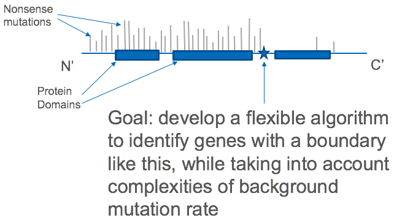

For an updated list of my publications, please visit [Google Scholar](https://scholar.google.com/citations?user=AhXbVY0AAAAJ&hl=en&citsig=AMD79orj40uaLaTKXYTrF7m-D9Zd7ZGUjQ).

I primarily collaborate on projects using multimodal genomic data in oncology research at [Memorial Sloan Kettering Cancer Center](https://www.mskcc.org/). I work with [Ronglai Shen](https://www.mskcc.org/profile/ronglai-shen)  using data from [The Cancer Genome Atlas](https://cancergenome.nih.gov/) to research cancer subtype classification and refinement. I also collaborate with [Kay See Tan](https://www.mskcc.org/profile/kay-see-tan), providing statistical analysis for Anesthesia and Critical Care research at MSKCC. My other main area of interest is working on an algorithm to detect clustering patterns of nonsense mutations across multiple cancer tumor types under the guidance of [Yufeng Shen](https://www.dbmi.columbia.edu/people/yufeng-shen/) in the [Department of Biomedical Informatics](https://www.dbmi.columbia.edu/) at Columbia. 


```{r, echo = FALSE, out.width = "40%"}
library(knitr)

```


