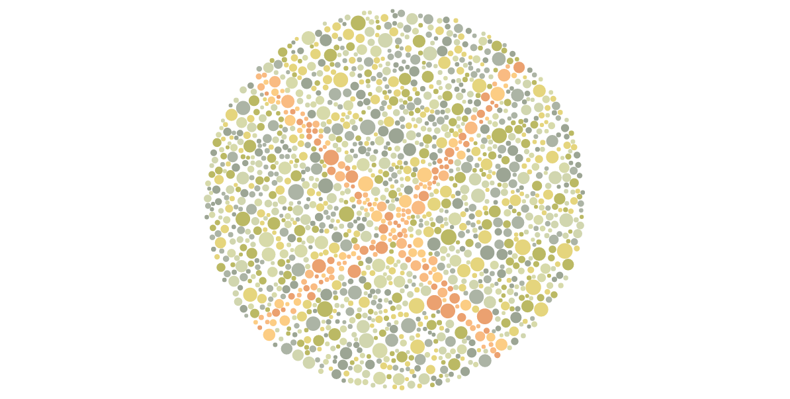

### X-Linked Disease Trait Generation Simulator

I created a Shiny app to look at proportions of genotypes for an X-linked disease trait (such as color-blindness). Explore the app to see how many generations it takes for the population to reach equilibrium (it's surprisingly not many!), and how the equilibrium proportions change based on the initial population. 

The app can be found [here](https://margarethannum.shinyapps.io/xlinked_trait_generation_simulator/)! 

```{r, echo = FALSE, out.width = "80%"}
library(knitr)

```

Image created using [Francisco Uzo's Isihara Plate Generator](https://franciscouzo.github.io/ishihara/)